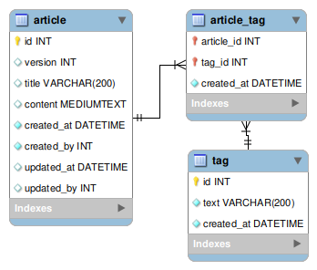

# Пример: простейший сервис для хранения статей внутренней Wiki

Пример для курса "Базы данных", сделан на PHP8 и MySQL8, проверен на Linux.

В этом примере есть:

1. Работа с транзакциями (см. классы `ArticleService` и `Synchronization`)
2. INSERT ODKU, также известный как UPSERT (см. классы `ArticleRepository`, `TagRepository`)
3. Применение оптимистичной блокировки (см. класс `ArticleRepository`)

## Схема БД

## Запуск примера на Linux

Краткий план действий:

1. Установить docker и docker-compose
2. Запустить контейнеры по инструкции из файла `docs/docker.md`
3. Войти в контейнер скриптом `docker/bin/wiki-backend-app-bash` и выполнить `bin/doctrine-migrations --no-interaction migrations:migrate --allow-no-migration`
4. Открыть в браузере http://localhost

В идеале у вас:
- По адресу http://localhost/articles/list отдаётся пустой JSON массив
- При включении XDebug отладка работает

## Запуск примера в Windows

Краткий план действий:

1. Установить MySQL 8 и PHP 8.2
2. Запустить MySQL server
3. Открыть в MySQL Workbench и выполнить SQL запросы из файла `data/create_user.sql`
4. Из консоли в каталоге проекта выполнить `bin/doctrine-migrations --no-interaction migrations:migrate --allow-no-migration`
   - в случае проблем можно заменить на `php vendor\bin\doctrine-migrations --no-interaction migrations:migrate --allow-no-migration`
5. Из консоли и запустить отладочный сервер PHP:
    - `cd public`
    - `php -S localhost:8888`
6. Открыть в браузере `http://localhost:8888/articles/list` - будет пустой JSON массив

## Проверка работы

Проверить работу можно с помощью Postman. Готовые запросы можно импортировать в Postman из файла `docs/Postman.json`.
